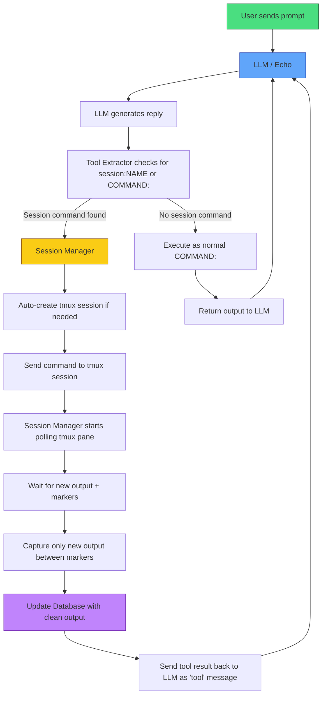

# Echo_rust_agent_proxy

```mermaid
flowchart TD
    A[User sends prompt] --> B[LLM / Echo]
    B --> C[LLM generates reply]
    C --> D[Tool Extractor checks for session:NAME or COMMAND:]
    
    D -->|Session command found| E[Session Manager]
    E --> F[Auto-create tmux session if needed]
    F --> G[Send command to tmux session]
    G --> H[Session Manager starts polling tmux pane]
    H --> I[Wait for new output + markers]
    I --> J[Capture only new output between markers]
    J --> K[Update Database with clean output]
    K --> L[Send tool result back to LLM as 'tool' message]
    
    D -->|No session command| M[Execute as normal COMMAND:]
    M --> N[Return output to LLM]
    
    L --> B
    N --> B
    
    style A fill:#4ade80,stroke:#166534
    style B fill:#60a5fa,stroke:#1e40af
    style E fill:#facc15,stroke:#854d0e
    style K fill:#c084fc,stroke:#6b21a8
```
